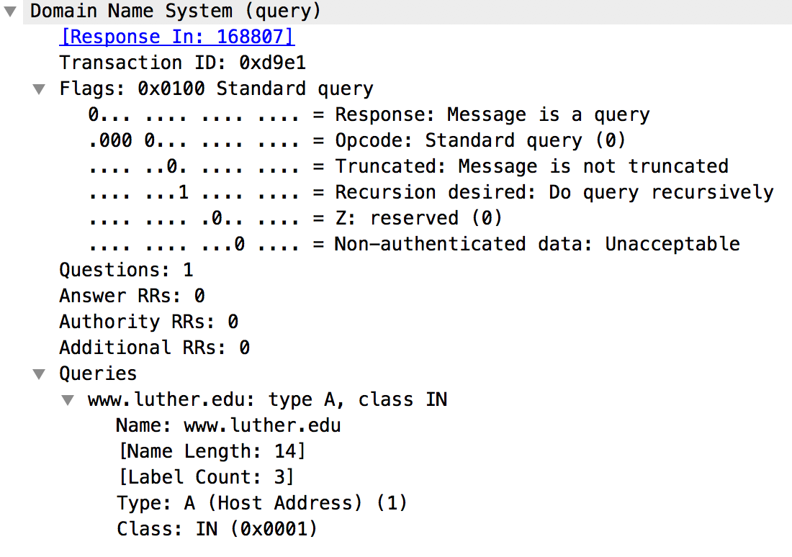
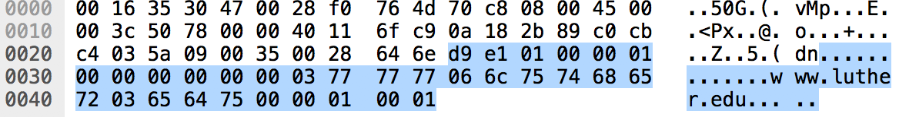

<<<<<<< HEAD
# Custom dig

Complete the following programming project and push code to your GitHub repository.

**Process records of type A (IPv4) or AAAA (IPv6) only. If a server returns CNAME record instead, ignore it.**

Use *yahoo.com* as an example of a clean and simple response.

Read record type (**A** or **AAAA**), domain name, and an optional DNS server as parameters passed to your program.

```
python3 resolver.py A luther.edu 1.1.1.1
```
or
```
python3 resolver.py AAAA yahoo.com
```

1. Format a DNS request using the following values:

    * Transaction ID: auto-incremental or random
    * Flags: standard query (recursion bit set to 1, other bits are 0)
    * Questions: 1
    * Answer RRs: 0
    * Authority RRs: 0
    * Additional RRs: 0
    * Name: user-provided
    * Type: user-provided
    * Class: IN (0x0001)

2. If the DNS address is not specified, pick one of the well-known public servers.

3. Create a UDP socket connection and send the request to the DNS server.

4. Parse the response message from the DNS server to extract all addresses (there could be more than 1).

5. Print the address of the DNS server used.

6. Display the received information in the following format:

```
Name: <domain name>
TTL: record time-to-live
Addresses: <list of addresses received>
```

7. Pass all tests provided.

```
python3 -m pytest test_resolver.py
=======
# Custom BIND

Complete the following programming project and push code to your GitHub repository.

**Process records of type A (IPv4) or AAAA (IPv6) only. If a client requests anything else, ignore it.**

Use your DNS resolver to initiate requests to the server.

```
python3 nameserver.py zoo.zone
```

1. Read the zone file *zoo.zone* and resolve names found there.

2. Create a UDP socket connection and wait for a message from the DNS resolver.

3. Parse the DNS request.

4. Find the domain in the zone file.

5. Format the response, byte by byte (you may want to use Python's bytearray for that).

6. Return answer(s).

7. Pass all tests provided.

```
python3 -m pytest test_nameserver.py
```

8. Use your `resolver.py` or `nslookup` to resolve some somain name from the zone file. Note that you need to connect to port **43053** on your **localhost**.


## Usage example

Using `resolver.py` to resolve type **A** address.

```
> python3 resolver.py A ant.cs430.luther.edu 127.0.0.1
DNS server used: 127.0.0.1
Domain: ant.cs430.luther.edu
TTL: 3600
Address: 185.84.224.89
Domain: ant.cs430.luther.edu
TTL: 3600
Address: 199.83.67.158
```

Using `resolver.py` to resolve type **AAAA** address.

```
python3 resolver.py AAAA ant.cs430.luther.edu 127.0.0.1
DNS server used: 127.0.0.1
Domain: ant.cs430.luther.edu
TTL: 3600
Address: 4a9a:70ec:3ac0:c684:359e:8d37:9486:5959
```

Using `nslookup` to resolve type **A** address.

```
> nslookup -port=43053 -type=A ant.cs430.luther.edu 127.0.0.1
Server:		127.0.0.1
Address:	127.0.0.1#43053

Non-authoritative answer:
Name:	ant.cs430.luther.edu
Address: 185.84.224.89
Name:	ant.cs430.luther.edu
Address: 199.83.67.158
```

Using `nslookup` to resolve type **AAAA** address.

```
> nslookup -port=43053 -type=AAAA ant.cs430.luther.edu 127.0.0.1
Server:		127.0.0.1
Address:	127.0.0.1#43053

Non-authoritative answer:
Name:	ant.cs430.luther.edu
Address: 4a9a:70ec:3ac0:c684:359e:8d37:9486:5959
>>>>>>> 6d61e9f1a651943f13ded305a633755da524f122
```

## Approach

<<<<<<< HEAD
* Look at a valid DNS request (eg. ping www.luther.edu and capture the traffic)



* Analyze the structure of a message (see the links below for details) and replicate it



* Format your own message, byte by byte (you may want to use Python's bytearray for that)

* Make your client format a message based on user input (domain, record type)

* Send the message and receive the response

* Parse the response and present the result (IP address). Consider simple cases (domain - one or more address(es)), ignore complex paypal-like resolutions with multiple pseudos.

## Resources

=======
* Look at a valid DNS response (eg. ping www.luther.edu and capture the traffic)

* Analyze the structure of a message (see the links below for details) and replicate it

## Functions

### val_to_bytes(value: int, n_bytes: int) -> list

`val_to_bytes` takes an integer and a number of bytes and returns that integer as a list of the specified length. Most fields in DNS response use 2 bytes, but TTL uses 4 bytes. Use shift (<<, >>) and masking (&) to generate the list.

### bytes_to_val(bytes_lst: list) -> int

`bytes_to_val` takes a list of bytes (values 0..255) and returns the value. Most values in DNS use 2 bytes, but you should implement a more generic algorithm to process a list of any length.

### get_left_bits(bytes_lst: list, n_bits: int) -> int

`get_left_bits` takes a 2-byte list and a number *n* and returns leftmost *n* bits of that sequence as an integer.

### get_right_bits(bytes_lst: list, n_bits: int) -> int

`get_right_bits` takes a 2-byte list and a number *n* and returns rightmost *n* bits of that sequence as an integer.

### read_zone_file(filename: str) -> tuple

`read_zone_file` takes file name as a parameter and reads the **zone** from that file. This function builds a dictionary of the following format: `{domain: [(ttl, class, type, address)]}` where each record is a list of tuples (answers). The function should return a tuple of `(origin, zone_dict)`. If the requested domain is not in our zon, `parse_request` should raise a `ValueError`. Note that the records in the zone file may be incomplete (missing a domain name or TTL). The missing domain name should be replaced with the one from the previous line, missing TTL should be replaced with the default one (2nd line of the zone file). If a record contains multiple answers, return them all.

### parse_request(origin: str, msg_req: bytes) -> tuple

`parse_request` takes `origin` and the request bytes and returns a tuple of (transaction id, domain, query type, query). The query is required as it is included in the response. This function must raise `ValueError`s if the type, class, or zone (origin) cannot be processed. Those exceptions are caught in the `run` function.

```
56 f0 01 00 00 01 00 00 00 00 00 00 06 6c 75 74 68 65 72 03 65 64 75 00 00 01 00 01
|---| |---| |---| |---| |---| |---| |------------------| |---------| || |---| |---| 
|id | |flags, # of questions etc  | | luther           | | edu     | \0 |typ| |cls|
                                    |------------------query----------------------|
```

### format_response(zone: dict, trans_id: int, qry_name: str, qry_type: int, qry: bytearray) -> bytearray

`format_response` takes the zone dictionary, transaction_id, domain name, and the query. It formats the DNS response (bytearray) based on those values and returns it to the calling function. Your should either *label* or *pointer* to format the domain name.

### run(filename: str) -> None

`run` is the main loop of the server and is implemented for your convenience.

## Resources

* [RFC 1034 - Domain names - concepts and facilities](https://tools.ietf.org/html/rfc1034)

>>>>>>> 6d61e9f1a651943f13ded305a633755da524f122
* [RFC 1035 - Domain names - implementation and specification](https://tools.ietf.org/html/rfc1035)

* [The TCP/IP Guide - DNS Messaging and Message, Resource Record and Master File Formats](http://www.tcpipguide.com/free/t_DNSMessagingandMessageResourceRecordandMasterFileF.htm)

* [Chapter 15 DNS Messages](http://www.zytrax.com/books/dns/ch15/)

* [Domain Name System (DNS) Parameters](http://www.iana.org/assignments/dns-parameters/dns-parameters.xhtml)
=======
# Simple Web Server

For this project you are going to write a simple web server using Python sockets only (i.e. no Flask, not even http.server). Your server should have the following functionality:

1. Bind to TCP port **4300** on **127.0.0.2** and accept 1 request at a time.
2. Serve a single file, *alice30.txt*.
3. Log details of each incoming request to *webserver.log*.
4. Return *405 Method Not Allowed* error for any method other than *GET*
5. Return *404 Not Found* error for any request other than */alice30.txt*.
6. Send the content of *alice30.txt* to the client along with proper response header.

## Request

A typical request header sent by a browser (Chrome in this case) looks as follows:

```
GET /alice30.txt HTTP/1.1
Host: 127.0.0.2:4300
Connection: keep-alive
Pragma: no-cache
Cache-Control: no-cache
Upgrade-Insecure-Requests: 1
User-Agent: Mozilla/5.0 (X11; Linux x86_64) AppleWebKit/537.36 (KHTML, like Gecko) Chrome/70.0.3538.77 Safari/537.36
Accept: text/html,application/xhtml+xml,application/xml;q=0.9,image/webp,image/apng,*/*;q=0.8
Accept-Encoding: gzip, deflate, br
Accept-Language: en-US,en;q=0.9

```

Use `curl` to initiate a *POST* request and see a 405 error:

```
curl -X POST http://127.0.0.2:4300/alice30.txt
```

## Log

Log file should contain the following information:

1. Time of the request.
2. Requested file.
3. IP address of the client.
4. Browser vendor and version.

```
2018-11-05 09:10:52.906984 | /alice.txt | 127.0.0.1 | Mozilla/5.0 (X11; Linux x86_64) AppleWebKit/537.36 (KHTML, like Gecko) Chrome/70.0.3538.77 Safari/537.36
2018-11-05 09:12:18.072352 | /alice30.txt | 127.0.0.1 | Mozilla/5.0 (X11; Linux x86_64) AppleWebKit/537.36 (KHTML, like Gecko) Chrome/70.0.3538.77 Safari/537.36
2018-11-05 09:15:00.526359 | /alice.txt | 127.0.0.1 | Mozilla/5.0 (X11; Linux x86_64) AppleWebKit/537.36 (KHTML, like Gecko) Chrome/70.0.3538.77 Safari/537.36
2018-11-05 09:21:58.869701 | /alice.txt | 127.0.0.1 | Mozilla/5.0 (X11; Linux x86_64) AppleWebKit/537.36 (KHTML, like Gecko) Chrome/70.0.3538.77 Safari/537.36
2018-11-05 09:22:06.622828 | /alice30.txt | 127.0.0.1 | Mozilla/5.0 (X11; Linux x86_64) AppleWebKit/537.36 (KHTML, like Gecko) Chrome/70.0.3538.77 Safari/537.36
```

## Response

Your server must include the following headers in the response:

1. HTTP version: 1.1
2. Response code: 200 OK
3. `Content-Length`: length of *alice30.txt*.
4. `Content-Type`: plain text (**not** html).
5. `Date`: current date
6. `Last-Modified`: Friday, August 29, 2018 11:00 AM
7. `Server`: must include **your name**

The response header sent by your server should look as follows (date and server are going to be different):

```
HTTP/1.1 200 OK
Content-Length: 148545
Content-Type: text/plain; charset=utf-8
Date: Sun Nov  4 23:25:40 2018
Last-Modified: Wed Aug 29 11:00:00 2018
Server: CS430-ROMAN

```

## References

* [RFC 7231 - Hypertext Transfer Protocol (HTTP/1.1): Semantics and Content](https://tools.ietf.org/html/rfc7231)

* [Request header - MDN Web Docs Glossary: Definitions of Web-related terms | MDN](https://developer.mozilla.org/en-US/docs/Glossary/Request_header)

* [Response header - MDN Web Docs Glossary: Definitions of Web-related terms | MDN](https://developer.mozilla.org/en-US/docs/Glossary/Response_header)

* [Alice's Adventures in Wonderland](www.umich.edu/~umfandsf/other/ebooks/alice30.txt)
>>>>>>> 1c38431755768800b566efddea6587b9c65a5cf5
